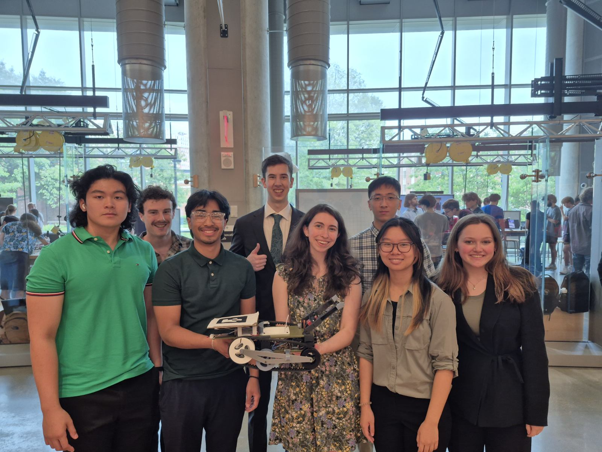

# Oscar's Garbage Truck




**Oscar's Garbage Truck** is a purpose-built autonomous vehicle created to complete the UMD ENES100 Data Extraction Mission. During the Spring 2025 semester, this OTV received the *Most Innovative Design Award* and tied for the *Best Mission Performance Award for Data Extraction* at the ENES100 Showcase. This repository contains assignment documents, full run completion videos, and the source code used by the OTV.

## Table of Contents

- [License](#license)
- [Repository Structure](#repository-structure)
- [Dependencies](#dependencies)
- [Detailed Description](#detailed-description)
- [Known Issues](#known-issues)
- [Usage](#usage)
- [Contributors](#contributors)
- [Acknowledgements](#acknowledgements)

---

## License

This project is primarily licensed under the **MIT License** – see the [LICENSE](LICENSE) file for full terms.

It also uses third-party libraries licensed under other open source licenses:

- **ENES100ArduinoLibrary** – Portions included in this repository under the **GNU General Public License v3.0 (GPL-3.0)**.  
  [View original repository](https://github.com/username/ENES100ArduinoLibrary)

- **Servo Library** – Used via `#include <Servo.h>` and not included in this repository.  
  Available through the Arduino Library Manager.  
  Licensed under the **GNU Lesser General Public License v2.1 (LGPL-2.1)**.  
  [View library](https://github.com/arduino-libraries/Servo)
  
---

## Repository Structure

```
.
├── LICENSE                # MIT license + GPL-3.0 and LGPL-2.1 notices
├── OTV.ino                # Main Arduino sketch
├── README.md              # Project overview and usage
├── docs/
│   ├── Project_Documentation  # Assignment documents
│   ├── Videos                 # OTV full run videos
│   └── Images                 # Team photo
├── libs/
│   ├── OTV.h                  # Custom header (includes Servo.h)
│   ├── ext_libs/
│   │   └── ENES100ArduinoLibrary/
│   │       ├── Enes100.h
│   │       ├── VisionSystemClient.cpp
│   │       └── VisionSystemClient.hpp
│   └── src/                  # Custom source code for the OTV
```

---

## Dependencies

The following external libraries are required:

- **Servo**  
  Must be installed via the Arduino Library Manager:  
  Go to **Tools > Manage Libraries**, search for “Servo”, and install the library published by Arduino.  
  This library is not bundled with the repository.

---

## Detailed Description

The OTV is designed to autonomously navigate to a mission site, complete a set of data extraction tasks, and traverse obstacles to reach the goal zone. Mission tasks include:

- Extracting a puck from a mission pylon
- Detecting the puck’s magnetism
- Transmitting the duty cycle of a square wave (from aluminum output nodes) to the ENES100 vision system

Obstacles include:

- Two non-traversable blocks
- One traversable block
- A limbo bar and a log

Block positions are randomized within a 3x2 grid at the center of the arena. The log and limbo are placed in a final column near the goal. The pylon and start location are randomized along one side of the field, and the OTV always starts facing away from the mission site.

Learn more about the project at the [ENES100 Website](https://enes100.umd.edu)

### Our Design

The OTV has two specialized sides:

- Mission-Specific Side — Includes a claw used to flip the pylon onto an interface plate mounted on top of the OTV. This plate helps secure the puck and perform data extraction.
- Obstacle-Navigation Side — Faces forward during obstacle traversal. It features raised tank treads for traction over the log and traversable block, and limit switches for detecting non-traversable obstacles.

For full documentation and run videos, see the [docs](./docs/) directory.

---

## Known Issues

Despite its success, the OTV had unresolved bugs and strategic limitations. To preserve historical accuracy, no fixes were made post-showcase. Comments marked `EDIT:` in the [source code](./libs/src/) reflect post-project reflections and guidance for future iterations.

The following is a list of the most glaring issues we observed and were not able to fix during our time working on the project.

- **Random Reset in Stage02**
    The OTV sometimes resets to Stage01 after flipping the pylon. This appears related to the puck magnetism check, but the exact cause remains undetermined by the team.
    *Impact:* The issue was non-fatal if the pylon was flipped correctly since the OTV would eventually get past the bug and complete the run under 5 minutes.
- **Stage01 Navigation Strategy**
    Our approach to align and approach the pylon was inconsistent. It relied on hardcoded timing and position estimates that were unreliable across runs and between vision systems.
    *Suggested Fix:* Use an ultrasonic sensor and/or limit switches mounted below the claw for accurate alignment and detection.
- **Stage03 Alignment**
    The OTV often approached obstacles at an angle after Stage02, causing misalignment. We used a double-alignment workaround, but a more robust solution is recommended.
- **Code Structure**
    If the team members responsible for coding the OTV could reformat the code, they would. There are multiple instances where refactoring for functional decomposition would be beneficial, specifically in [obstacle_navigation.c](./libs/src/obstacle_navigation.c) and [mission_objective.cpp](./libs/src/mission_objective.cpp). Naming conventions could also be improved.

---

## Usage

To recreate or build upon this project:

1. Review the [Project_Documentation](./docs/Project_Documentation/) and [source code](./libs/src/).
2. Install required libraries via the Arduino Library Manager.
3. Fork/clone this repository into a folder called "OTV" on your local development machine.
4. Adjust macro values in OTV.ino and related source files — current values are hardcoded for our showcase configuration.
5. Build and test your OTV accordingly.

Note: This repository is archived and will not accept contributions. Please fork or create your own repository for derivative projects.

**For ENES100 Students:**
Use this repository for inspiration only. Avoid directly copying designs or solutions. The purpose of ENES100 is to develop your own engineering process, creativity, and collaboration. Build your own project — don’t waste the opportunity by duplicating ours.

---

## Contributors

Below are the names and contact information of each team member. Contact information only includes LinkedIn profiles and GitHub accounts if the team member has one as of May 2025.

- Thomas Kimberlin - [LinkedIn](www.linkedin.com/in/thomas-kimberlin) | [GitHub](https://github.com/ThomasKimberlin)
- Ryan Tran - [LinkedIn](https://www.linkedin.com/in/rht0120/) | [GitHub](https://github.com/RyanfromBryan)
- Steven Vilcheck - [LinkedIn](https://www.linkedin.com/in/steven-vilcheck-602180320/)
- Jacquelyn Eng - [LinkedIn](https://www.linkedin.com/in/jacquelyn-eng-358281332/)
- Ariana Butterworth - [LinkedIn](https://www.linkedin.com/in/ariana-butterworth-a5a882335/)
- Ella Beirly - [LinkedIn](https://www.linkedin.com/in/ella-bierly-43b01a35a/)
- Vihaan Le - [LinkedIn](https://www.linkedin.com/in/vihaan-le-064623356/)
- Phillip Chen - [LinkedIn](https://www.linkedin.com/in/phillip-chen-4aa3aa32b/)

---

## Acknowledgements

- Portions of the code are based on the ENES100ArduinoLibrary, used under the GPL-3.0 license.
- Servo control is handled using the Arduino Servo library (LGPL-2.1).

